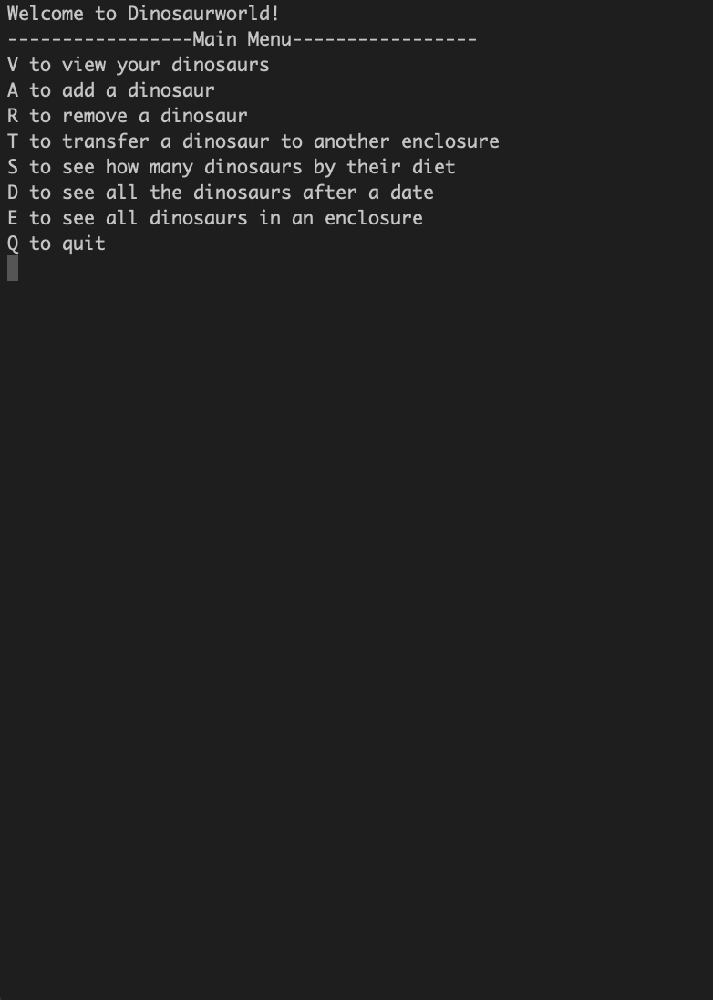

# 02-03 Jurrasic Park

# Assignment Overview

In this assignment, you will be creating a console application that manages a zoo
full of dinosaurs.

## Objectives

- Practice control structures.
- Practice data structures.
- Practice working with user data.
- Practice with LINQ.
- Practice with OOP concepts.

## Requirements

- Create a console application that manages the dinosaurs in your zoo.

### Explorer Mode

- [x] Create a class to represent your dinosaurs. The class should have the following properties

  - [x] `Name`
  - [x] `DietType` - This will be "carnivore" or "herbivore"
  - [x] `WhenAcquired` - This will default to the current time when the
        dinosaur is created
  - [x] `Weight` - How heavy the dinosaur is in pounds.
  - [x] `EnclosureNumber` - the number of the pen the dinosaur is currently in

- [x] Add a method `Description` to your class to print out a description of the dinosaur to include all of its properties. Create an output format of your choosing.
- [x] Your dinosaurs will be stored in a `List<Dinosaur>`.
- [x] When the console application runs, it should let the user choose one of the following actions:
  - [x] `View`
    - This command will show the all the dinosaurs in the list, ordered by `WhenAcquired`
  - [x] `Add`
    - This command will let the user type in the information for a dinosaur and add it to the list
  - [x] `Remove`
    - This command will prompt the user for a dinosaur name then find and delete the dinosaur with that name.
  - [x] `Transfer`
    - This command will prompt the user for a dinosaur name and a new `EnclosureNumber` and update that dino's information.
  - [x] `Summary`
    - [x] This command will display the number of carnivores and the number of herbivores.
  - [x] `Quit`
    - [x] This will stop the program

### Adventure Mode

- [x] Add an option to view the Dinosaurs acquired after a given date (to be given by the user).
- [x] Add an option to view all the Dinosaurs in a given enclosure number.

### Epic Mode

- [x] Learn how to read and write from a file. At the start of the program load all the dinosaurs from a file. When the program ends write out all the dinosaurs to the same file.
